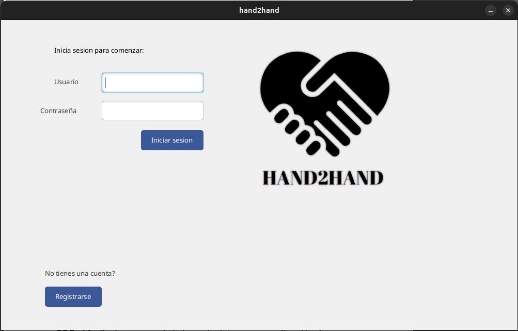
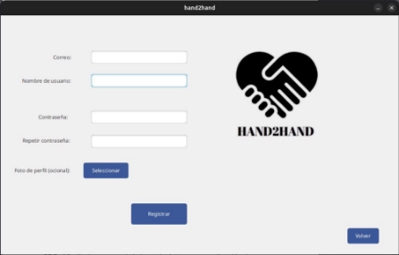
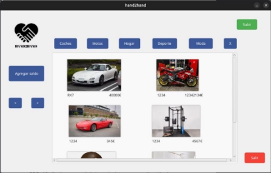
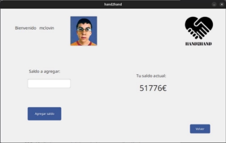
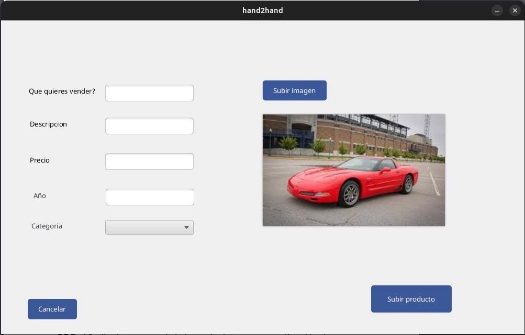

HAND2HAND

Compraventa de productos de 2a mano

- Este programa usa las tecnologías:
  - Interfaz de usuario JavaFX
  - Bases de datos MySQL
  - Java como lenguaje de programación
- Interfaz:
- Al entrar a la aplicación podemos ver la página de login con los botones iniciar sesión y registrarse.
- Registro: Introduciremos nuestros datos personales junto a la foto de perfil
- LogIn: al estar registrados podremos entrar a la página principal.
- Página principal: en esta página podremos observar arriba los botones de filtros junto al de subir producto, el de agregar saldo, los de navegar por las páginas de productos y el de salir, también se puede pulsar en todos y cada uno de los productos si es que hay alguno subido.
- Subir: podremos rellenar los datos típicos de un producto junto a su imagen y subirlo a la base de datos.
- Agregar saldo: en este apartado podremos agregar saldo de una forma bastante intuitiva gracias al texto field y al número de saldo actual que podemos observar, también tenemos un botón de volver.
- Los botones de navegar por la página nos muestran productos más allá de la primera página, se podrán subir un número ilimitado de productos.
- Producto: al entrar en un producto veremos el botón azul como eliminar si el producto es nuestro, y comprar si el producto es de otro usuario, al comprarlo (no al eliminarlo) se nos restará el precio del producto del saldo.

- La base de datos se estructura en 2 tablas, la de productos y la de usuarios:

Las funciones más relevantes y complejas de la bbdd son la de mostrar los productos y la de eliminarlos.

-Cuando se hace click sobre un producto se muestra la información de ese producto, eso lo he hecho dándole un id al botón (botón 1) y quedandome con el número (1) en la palabra, así al pulsar el botón sabremos a qué producto se refiere y podremos mostrar la información adecuada mediante una query sql.

-Al eliminar un producto se cambian todo los productos con id mayor a la del producto eliminado a una id menos, esto hace que se muestran en la posición adecuada en todo momento.
